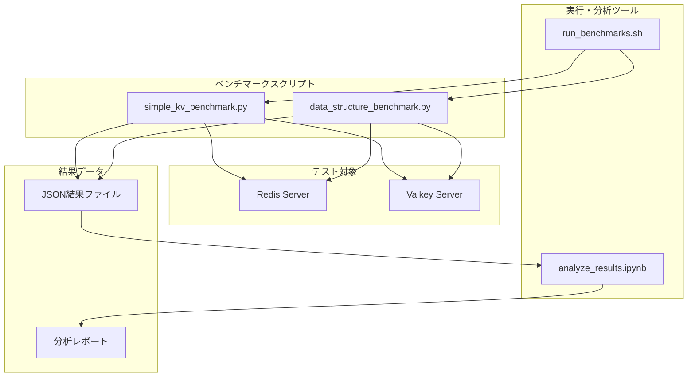
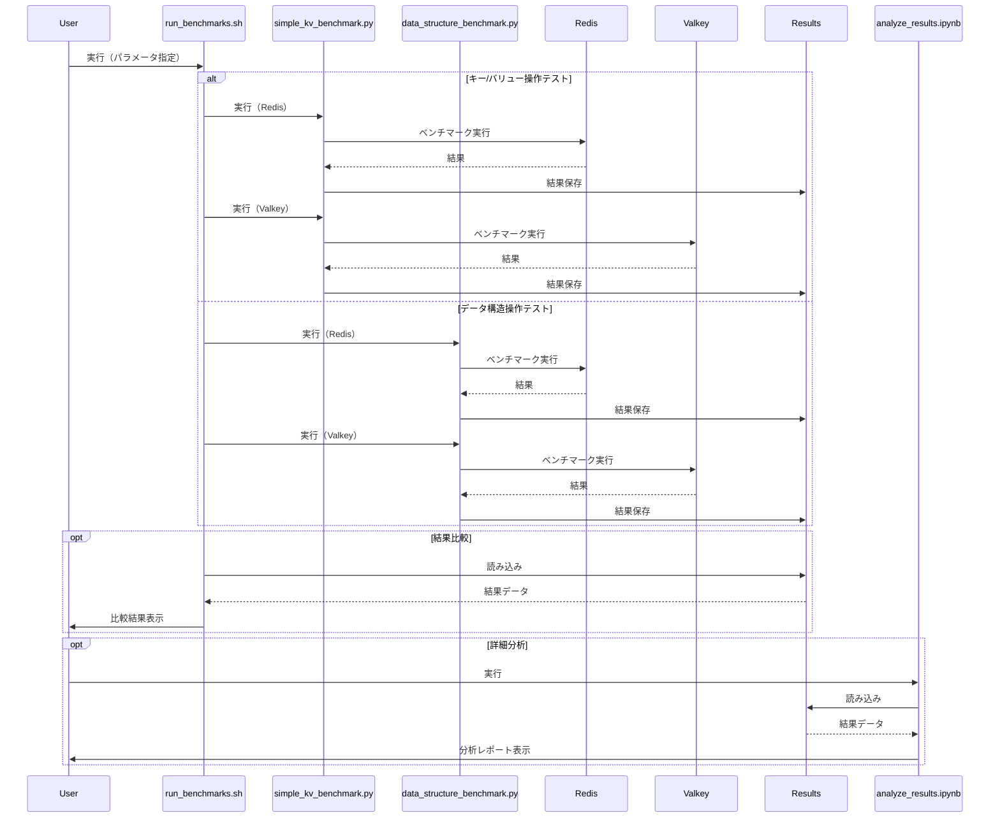

# システムパターン: AWS Elasticache Redis vs Valkey 性能比較

## システムアーキテクチャ

このプロジェクトは、以下の主要コンポーネントから構成されています：



## コンポーネント設計

### 1. ベンチマークスクリプト

#### 1.1 simple_kv_benchmark.py

基本的なキー/バリュー操作（GET/SET）のベンチマークを実行するPythonスクリプトです。

**主要クラス**:
- `BenchmarkConfig`: ベンチマーク設定を管理するクラス
- `BenchmarkResult`: ベンチマーク結果を管理するクラス
- `KeyValueBenchmark`: ベンチマークを実行するクラス

**設計パターン**:
- **設定オブジェクト**: 設定をカプセル化し、一貫した方法で管理
- **結果オブジェクト**: 結果データと分析メソッドをカプセル化
- **ファクトリーメソッド**: クライアント接続の生成を抽象化

#### 1.2 data_structure_benchmark.py

様々なデータ構造（リスト、ハッシュ、セット、ソート済みセット）の操作性能を測定するPythonスクリプトです。

**主要クラス**:
- `DataStructureType`: データ構造タイプを定義するEnum
- `BenchmarkConfig`: ベンチマーク設定を管理するクラス
- `OperationResult`: 個々の操作結果を管理するクラス
- `BenchmarkResult`: ベンチマーク結果を管理するクラス
- `DataStructureBenchmark`: ベンチマークを実行するクラス

**設計パターン**:
- **Enumパターン**: データ構造タイプを明示的に定義
- **コマンドパターン**: 各操作をカプセル化し、一貫した方法で実行
- **ストラテジーパターン**: データ構造タイプに応じて異なる操作戦略を適用

### 2. 実行・分析ツール

#### 2.1 run_benchmarks.sh

ベンチマークスクリプトを実行し、結果を収集するシェルスクリプトです。

**主要機能**:
- コマンドライン引数の解析と検証
- Redis/Valkeyサーバーへの接続設定
- ベンチマークスクリプトの実行と結果の保存
- 結果の比較と表示

**設計パターン**:
- **ファサードパターン**: 複雑なベンチマーク実行プロセスをシンプルなインターフェースで提供
- **テンプレートメソッド**: 共通のベンチマーク実行フローを定義

#### 2.2 analyze_results.ipynb

ベンチマーク結果を分析し、視覚化するJupyter Notebookです。

**主要機能**:
- 結果ファイルの読み込みと解析
- 統計分析と比較
- グラフ作成と視覚化
- レポート生成

**設計パターン**:
- **オブザーバーパターン**: データの変更に応じてグラフを更新
- **ビジターパターン**: 異なる結果データ構造に対して一貫した分析を適用

### 3. テスト対象

#### 3.1 Redis Server

標準のRedisサーバー（ローカル環境またはAWS Elasticache）

#### 3.2 Valkey Server

Valkeyサーバー（ローカル環境のDockerコンテナまたはAWS Elasticache）

### 4. 結果データ

#### 4.1 JSON結果ファイル

ベンチマーク結果を保存するJSONファイル。以下の構造を持ちます：

```json
{
  "config": {
    // ベンチマーク設定
  },
  "engine_type": "Redis|Valkey",
  "start_time": "ISO日時",
  "end_time": "ISO日時",
  "stats": {
    // 統計情報
  }
}
```

#### 4.2 分析レポート

Jupyter Notebookから生成される分析レポート。グラフ、表、考察を含みます。

## データフロー

ベンチマーク実行時のデータフローは以下の通りです：



## 設計原則

このプロジェクトでは、以下の設計原則に従っています：

1. **モジュール性**: 各コンポーネントは独立して機能し、明確な責任を持つ
2. **再利用性**: 共通のコードと設定を再利用し、重複を最小限に抑える
3. **拡張性**: 新しいテストケースやデータ構造を容易に追加できる設計
4. **可読性**: コードとドキュメントは明確で理解しやすく
5. **再現性**: テスト結果が再現可能であり、環境依存性を最小限に抑える

## 技術的な考慮事項

### 並列処理

ベンチマークスクリプトでは、`concurrent.futures`モジュールを使用して並列処理を実装しています。これにより、複数のスレッドから同時にRedis/Valkeyサーバーにアクセスし、実際の運用環境に近い負荷をシミュレートします。

### エラーハンドリング

各操作は適切なエラーハンドリングを実装し、一部の操作が失敗してもベンチマーク全体が中断されないようにしています。エラー数も結果の一部として記録され、分析に含まれます。

### パフォーマンス測定

パフォーマンス測定には、Pythonの`time`モジュールを使用しています。ミリ秒単位の精度で各操作の実行時間を測定し、統計情報（平均、中央値、パーセンタイルなど）を計算します。

### 結果の保存と分析

結果はJSON形式で保存され、後で分析ツールで読み込むことができます。分析には、pandas、matplotlib、seabornなどのライブラリを使用し、データの処理と視覚化を行います。

## 将来の拡張性

このシステムは、以下のような拡張が可能です：

1. **新しいテストケース**: 新しいワークロードパターンやテストケースを追加
2. **分散テスト**: 複数のクライアントマシンからの分散テストをサポート
3. **継続的ベンチマーク**: CI/CDパイプラインと統合し、継続的なベンチマークを実施
4. **追加のエンジン**: 他のRedis互換エンジンとの比較をサポート
5. **高度な分析**: 機械学習を用いたパターン分析や予測モデルの構築
