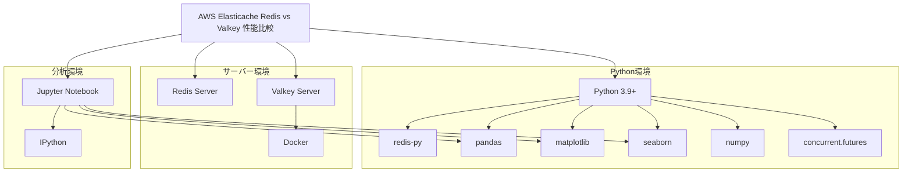

# 技術コンテキスト: AWS Elasticache Redis vs Valkey 性能比較

## 技術スタック

### プログラミング言語

- **Python 3.9+**: ベンチマークスクリプトの実装に使用
- **Bash**: ベンチマーク実行スクリプトの実装に使用

### ライブラリとフレームワーク

#### Python ライブラリ

- **redis-py**: Redis/Valkeyサーバーとの通信に使用
- **pandas**: データ処理と分析に使用
- **matplotlib**: データの視覚化に使用
- **seaborn**: 高度なデータ視覚化に使用
- **numpy**: 数値計算と統計処理に使用
- **concurrent.futures**: 並列処理の実装に使用
- **argparse**: コマンドライン引数の解析に使用
- **json**: 結果データの保存と読み込みに使用
- **time**: パフォーマンス測定に使用
- **statistics**: 統計計算に使用
- **enum**: 列挙型の定義に使用
- **typing**: 型ヒントの提供に使用

#### Jupyter Notebook

- **IPython**: 対話的な分析環境を提供
- **Jupyter Widgets**: インタラクティブな要素を追加

### インフラストラクチャ

#### ローカル環境

- **Redis Server**: 標準のRedisサーバー（バージョン 7.0以上）
- **Docker**: Valkeyサーバーの実行環境
- **Valkey Docker Image**: Valkeyサーバーのコンテナイメージ

#### AWS環境

- **AWS Elasticache for Redis**: AWSが提供するマネージドRedisサービス
- **AWS Elasticache for Valkey**: AWSが提供するマネージドValkeyサービス

## 開発環境

### ローカル開発環境

- **オペレーティングシステム**: Linux/macOS/Windows（WSL推奨）
- **Python環境**: Python 3.9以上
- **Docker**: Valkeyサーバーの実行に必要
- **Redis**: ローカルテスト用のRedisサーバー
- **エディタ/IDE**: VS Code、PyCharm、Jupyterなど
- **バージョン管理**: Git

### 推奨開発ツール

- **VS Code**: コード編集とデバッグ
  - Python拡張機能
  - Jupyter拡張機能
  - Docker拡張機能
- **Jupyter Lab/Notebook**: 分析と視覚化
- **Redis CLI**: Redisサーバーとの対話的な操作
- **Redis Insight**: Redisデータの視覚的な管理
- **Docker Desktop**: Dockerコンテナの管理

## 技術的な制約

### パフォーマンス測定の制約

- **時間測定の精度**: Pythonの`time`モジュールの精度に依存（マイクロ秒レベル）
- **システムノイズ**: OSのスケジューリングやその他のプロセスによる影響
- **ネットワークレイテンシ**: ネットワーク経由のアクセスによる追加のレイテンシ
- **JITコンパイル**: Pythonの実行時最適化による初期実行の遅延

### 環境依存性

- **ハードウェア依存**: テスト結果はハードウェア性能に依存
- **ネットワーク依存**: ネットワーク環境によって結果が変動
- **負荷依存**: システム全体の負荷状況によって結果が変動
- **設定依存**: Redis/Valkeyの設定によって結果が変動

### スケーラビリティの制約

- **メモリ制約**: 大規模データセットのテストはメモリ制約を受ける
- **スレッド制約**: Pythonの`GIL`（グローバルインタプリタロック）による並列処理の制約
- **接続数制約**: Redis/Valkeyサーバーの最大接続数による制約

## 依存関係

### 外部依存関係



### バージョン要件

| 依存関係 | 最小バージョン | 推奨バージョン | 備考 |
|---------|--------------|--------------|------|
| Python | 3.9 | 3.11 | 型ヒントと最新機能のサポート |
| redis-py | 4.0 | 4.5+ | 最新のRedis機能をサポート |
| pandas | 1.3 | 2.0+ | 高度なデータ処理機能 |
| matplotlib | 3.4 | 3.7+ | 視覚化機能の向上 |
| seaborn | 0.11 | 0.12+ | 高度な統計視覚化 |
| numpy | 1.20 | 1.24+ | パフォーマンスと機能の向上 |
| Redis Server | 6.0 | 7.0+ | 最新機能と性能改善 |
| Valkey | 最新 | 最新 | 常に最新バージョンを使用 |
| Docker | 20.10 | 最新 | Valkeyコンテナの実行に必要 |
| Jupyter | 6.0 | 最新 | 分析環境 |

## インストールと設定

### 開発環境のセットアップ

#### 1. Python環境のセットアップ

```bash
# 仮想環境の作成
python -m venv venv
source venv/bin/activate  # Linuxの場合
# または
.\venv\Scripts\activate  # Windowsの場合

# 必要なパッケージのインストール
pip install redis pandas matplotlib seaborn numpy jupyter
```

#### 2. Redisサーバーのセットアップ

**Linux (Ubuntu/Debian)**:
```bash
sudo apt update
sudo apt install redis-server
sudo systemctl start redis-server
```

**macOS (Homebrew)**:
```bash
brew install redis
brew services start redis
```

**Windows**:
WSLを使用するか、Windows用のRedisをインストール

#### 3. Valkeyサーバーのセットアップ (Docker)

```bash
# Valkeyイメージの取得
docker pull valkey/valkey

# Valkeyコンテナの実行
docker run -d --name valkey -p 6380:6379 valkey/valkey
```

### AWS Elasticacheの設定

AWS Elasticacheを使用する場合は、以下の設定が必要です：

1. AWS Management Consoleにログイン
2. Elasticacheサービスに移動
3. Redis/Valkeyクラスターを作成
   - エンジンタイプの選択（Redis/Valkey）
   - ノードタイプの選択（例：cache.m5.large）
   - レプリケーションの設定
   - セキュリティグループの設定
4. エンドポイント情報を取得
5. ベンチマークスクリプトの接続設定を更新

## 技術的なリスクと対策

| リスク | 影響 | 対策 |
|-------|------|------|
| Python GIL | 並列処理の制限 | マルチプロセスの使用、C拡張の検討 |
| ネットワーク遅延 | 測定精度の低下 | ローカルネットワークでのテスト、複数回の測定 |
| システムノイズ | 結果の変動 | 統計的手法による分析、外れ値の除外 |
| メモリ制約 | 大規模テストの制限 | テストデータサイズの最適化、段階的なテスト |
| バージョン差異 | 結果の一般化の困難さ | 複数バージョンでのテスト、バージョン情報の記録 |
| 環境依存性 | 再現性の低下 | 環境情報の詳細な記録、Docker環境の利用 |
| 負荷生成の限界 | 高負荷テストの不完全さ | 分散クライアントの検討、段階的な負荷増加 |

## パフォーマンスチューニング

### Redis/Valkeyサーバーの最適化

ベンチマークの正確性を高めるために、以下のようなサーバー設定の最適化を検討します：

1. **メモリ管理**
   - `maxmemory`の適切な設定
   - 最適なメモリポリシー（`maxmemory-policy`）の選択

2. **接続設定**
   - `tcp-backlog`の調整
   - `tcp-keepalive`の最適化
   - 最大クライアント数（`maxclients`）の設定

3. **永続化設定**
   - RDB/AOF永続化の無効化（純粋なパフォーマンステスト時）
   - 永続化有効時の最適な設定

4. **スレッド設定**
   - IOスレッド数の最適化
   - スレッドキューの調整

### クライアント側の最適化

ベンチマーククライアント（Pythonスクリプト）のパフォーマンスを最適化するための設定：

1. **接続プール**
   - 適切な接続プールサイズの設定
   - 接続の再利用

2. **バッチ処理**
   - パイプライン処理の活用
   - 最適なバッチサイズの決定

3. **シリアライゼーション**
   - 効率的なデータシリアライゼーション
   - 圧縮の検討（大きな値の場合）

4. **並列処理**
   - 最適なスレッド数の決定
   - マルチプロセスの検討

## モニタリングと分析

### パフォーマンスモニタリング

ベンチマーク実行中のシステムリソース使用状況をモニタリングするための方法：

1. **サーバーリソース**
   - CPU使用率
   - メモリ使用量
   - ネットワークI/O
   - ディスクI/O（永続化有効時）

2. **クライアントリソース**
   - CPU使用率
   - メモリ使用量
   - ネットワーク接続状態

3. **Redis/Valkeyメトリクス**
   - コマンド実行数
   - キャッシュヒット率
   - メモリ断片化
   - レイテンシ統計

### 結果分析手法

ベンチマーク結果を分析するための統計的手法と視覚化技術：

1. **統計分析**
   - 記述統計（平均、中央値、標準偏差など）
   - パーセンタイル分析（p95、p99など）
   - 外れ値検出と処理

2. **視覚化技術**
   - 時系列グラフ
   - ヒストグラムと分布図
   - 箱ひげ図
   - ヒートマップ

3. **比較分析**
   - A/Bテスト手法
   - 統計的有意性テスト
   - 相対パフォーマンス指標

## 将来の技術的展望

このプロジェクトの技術的な発展方向：

1. **自動化とCI/CD統合**
   - 継続的なベンチマーク実行の自動化
   - 結果の自動分析と報告
   - 異常検出と通知

2. **高度な分析手法**
   - 機械学習を用いたパターン分析
   - 予測モデルの構築
   - 異常検出アルゴリズムの適用

3. **分散テスト環境**
   - 複数クライアントからの分散負荷テスト
   - クラウド環境を活用した大規模テスト
   - 地理的に分散したテスト

4. **追加のテストケース**
   - トランザクション処理のベンチマーク
   - Lua スクリプトのパフォーマンステスト
   - クラスター環境でのテスト
